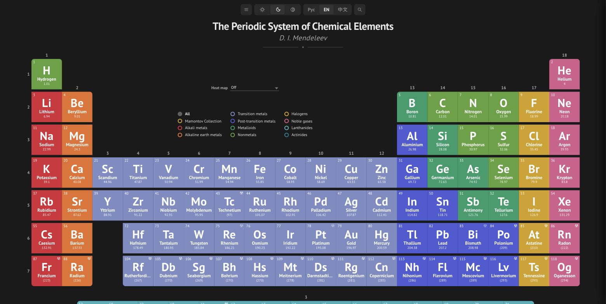
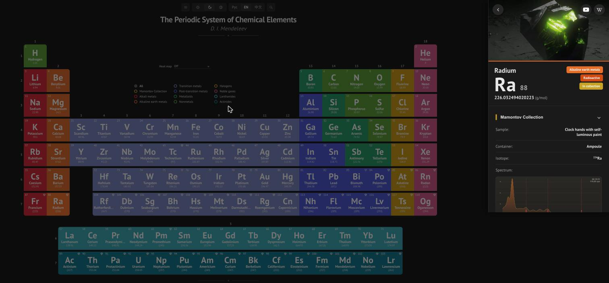
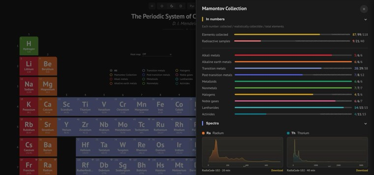

**English** | [Русский](README.ru.md) | [中文](README.zh.md)

# Periodic Table of Elements

An interactive periodic table built with Vue 3 + TypeScript: element cards packed with dozens of reference properties, and - the standout feature - a personal physical **Mamontov element collection** with sample photos, purity, isotopic composition, and gamma spectra recorded with a RadiaCode dosimeter.

## Demo

Live site: **[periodic.mamontov.tech](https://periodic.mamontov.tech)**

<table>
<tr>
<td><a href="docs/screenshots/demo-en.jpg"></a></td>
<td><a href="docs/screenshots/demo-en-element.jpg"></a></td>
<td><a href="docs/screenshots/demo-en-collection.jpg"></a></td>
</tr>
</table>

## Features

- **Full periodic table** - all 118 elements, including the f-block (lanthanides/actinides), with a responsive layout for desktop and mobile
- **Element card** - 12+ dedicated sections: overview, physical and thermodynamic properties, atomic and electromagnetic characteristics, crystal lattice, reactivity, natural abundance, applications
- **Element collection** - sample state and container, purity, isotope, origin (direct source / decay product with a multi-step decay chain), photos, an interactive gamma spectrum - click to enlarge, isotope reference lines confirmed against the actual measurement (not just copied from a table), original XML available for download
- **Collection overview** - a dedicated panel with collection stats by category and every recorded gamma spectrum in one place
- **Radioactivity** - radioactive elements flagged on the table, NFPA 704 and GHS pictogram cards, isotope and half-life data
- **Multilingual** - Russian, English, Chinese (instant switching, browser language auto-detection)
- **Dark/light theme** - manual or system-based
- **PWA** - installable on device, works offline (Workbox precache)

<details>
<summary><strong>Full list of element card properties</strong> (click to expand)</summary>

**Overview** - Latin name, English name, year of discovery, discoverer, country of discovery, CAS number, color, electron shell

**Description** - free-text summary

**Applications** - free-text overview of practical uses

**Properties** - atomic number, atomic mass, density, melting point, boiling point, valence, period, group, block, position on the periodic table (mini map), emission spectrum (image)

**Atomic properties** - electron configuration, ion charge, ionization potential, atomic radius, covalent radius, Van der Waals radius, oxidation states

**Reactivity** - electronegativity, valence, electron affinity

**Thermodynamic properties** - state of matter, molar heat of fusion, specific heat capacity, thermal expansion, molar heat of vaporization

**Electromagnetic properties** - electrical conductivity, electrical type, magnetic type, volume/mass/molar magnetic susceptibility, resistivity, superconductivity temperature

**Crystal lattice** - lattice structure, lattice parameters, ratio, Debye temperature, space group, space group number, lattice structure image

**Additional information** - CID number, RTEC number, Brinell/Mohs/Vickers hardness, bulk modulus, Young's modulus, liquid density, molar volume, Poisson's ratio, shear modulus, speed of sound, refractive index, thermal conductivity

**Nuclear properties** - radioactivity, main isotopes, decay mode, half-life, lifetime, neutron cross section, RadiaCode isotope reference (for radioactive elements)

**NFPA 704** - flammability, health hazard, reactivity, special hazard

**GHS hazard pictograms**

**Abundance** - share by mass in the universe, the Sun, the ocean, the human body, Earth's crust, and meteorites

</details>

## Tech stack

- [Vue 3](https://vuejs.org/) (Composition API, `<script setup>`) + [Vue Router 4](https://router.vuejs.org/)
- [TypeScript](https://www.typescriptlang.org/), [Vite 8](https://vitejs.dev/)
- [vite-plugin-pwa](https://vite-pwa-org.netlify.app/) (Workbox) - offline mode and auto-update
- Custom lightweight composables for i18n and theming (no external libraries like vue-i18n/Pinia)
- ESLint + typescript-eslint

## Quick start

Requires Node.js 22+ and [pnpm](https://pnpm.io/).

```bash
pnpm install
pnpm dev
```

The app will be available at `http://localhost:5173`.

## Make it your own collection

Forked this to track your own elements? Everything you need to change lives in **one file**: [`src/data/collection.ts`](src/data/collection.ts). No need to touch `elements/elements.json` or the locale files.

- `collectionName` / `siteTitle` / `siteUrl` - rename the collection and point it at your own domain.
- `myElements` - a `symbol → details` map. Add a key to mark an element as yours; `{}` alone is enough ("I have it, no details yet"). Each entry groups its fields by topic, all optional:
  - `physical` - `sampleState`, `container`, `purity`, `description`.
  - `radioactive` - `isotope`, `sourceType`, `decayParent`. Omit the whole group for non-radioactive elements.
  - `spectrum` - `id`, `filename`, `annotations`. Omit the whole group if you have no measurement file.
- If the built-in `sampleState`/`container` vocabulary (in [`src/locales/collection.ts`](src/locales/collection.ts)) doesn't cover your sample, either add a new entry there, or skip it entirely and put ready-made text straight into an element's `physical.description` field - see the radioactive elements in `collection.ts` for an example. `radioactive.sourceType` is fixed to `'primary'` / `'secondary'`.
- Every text field accepts either a plain string (shown in all three UI languages) or `{ ru, en, zh }` if you want it translated.

Gamma spectra (the `spectrum.id`/`spectrum.filename` fields) are optional - only set them if you actually have measurement files to drop into `src/data/spectra/`. `spectrum.annotations` marks reference gamma/X-ray lines on the chart (energy in keV + a label) - only add a line once you've confirmed it's both a documented emission line and actually visible against the background in your own measurement, not just copied from a table.

## Scripts

| Command | Purpose |
|---|---|
| `pnpm dev` | Dev server with hot reload |
| `pnpm build` | Type check (`vue-tsc`) + production build |
| `pnpm preview` | Preview the production build locally |
| `pnpm typecheck` | Type check only |
| `pnpm lint` / `pnpm lint:fix` | Lint (ESLint) |
| `pnpm check` | `typecheck` + `lint` |

### Project CLI

`cli/` is a small TypeScript tool (run via [`tsx`](https://github.com/privatenumber/tsx), no build step) with one entrypoint and three subcommands. Run `pnpm cli` with no arguments for an interactive menu, or a subcommand directly:

| Command | Purpose |
|---|---|
| `pnpm cli` | Interactive menu — pick a tool (sitemap / spectrum / collection) |
| `pnpm cli sitemap` (aliased as part of `pnpm build`) | Regenerate `public/sitemap.xml` from `src/data/elements/elements.json` |
| `pnpm data:spectrum:convert -- <input.xml> <output-id>` | Convert a RadiaCode XML spectrum → JSON for the collection |
| `pnpm data:collection:edit [-- <symbol>]` | Interactive wizard to add/edit/delete `collection.ts` entries — prompts for every field with the same vocab/dictionaries the app uses, validates `sampleState`/`container`/`sourceType` against `src/locales/collection.ts`, and checks a `spectrum.id` against the files actually present in `src/data/spectra/`. Pass an element symbol to jump straight to it, e.g. `pnpm data:collection:edit -- Fr`. Rewrites only the `myElements` object, leaving `collectionName`/`siteTitle`/`siteUrl` and comments untouched. Run `pnpm check` after saving. |

`cli/index.ts` is also registered as the package's `bin` (`periodic-table`), so `pnpm exec periodic-table <command>` works too. `cli/**/*.ts` is type-checked as part of `pnpm typecheck` (see `tsconfig.node.json`) and imports its types directly from `src/types/element.ts` and friends, so the wizard can't construct a `collection.ts` entry that doesn't match the app's own data model.

## Project structure

```
src/
├── components/      # UI components, grouped by topic:
│   ├── layout/      #   header, footer, menu, search, language/theme switchers
│   ├── table/       #   the periodic table itself: cells, filters, heatmap selector
│   ├── element/     #   the element detail sidebar
│   ├── collection/  #   collection panel and gamma-spectrum charts
│   └── common/      #   small components shared across the groups above
├── composables/     # reusable logic (useElementDetail)
├── data/            # element data, reference tables, collection spectra
├── locales/         # translations (ru/en/zh) and localization dictionaries
├── router/          # routes (/, /element/:symbol)
├── theme/           # theme handling (light/dark/auto)
├── types/           # element data types
├── utils/           # formatting, heatmaps, isotopes, GHS/NFPA
└── views/           # app screens
cli/                 # project CLI: sitemap generation, spectrum conversion, collection wizard
```

## Docker

```bash
docker build -t periodic-table .
docker run -p 3000:3000 periodic-table
```

Multi-stage build: `node:22-alpine` builds the production bundle, the final image is `nginx:alpine` serving the static files (see `Dockerfile`, `nginx.conf`). See `docker-compose.yml` for a Compose example.

## Data & attribution

Element reference properties, GHS pictograms, sample photos, and NFPA 704 ratings were aggregated from public sources (PubChem, Wikipedia, and others); the collection's gamma spectra are the author's own measurements. The data is intended for educational and personal-project use.

## License

The code in this repository is licensed under the [MIT License](LICENSE). Third-party reference data and images (see [Data & attribution](#data--attribution)) may be subject to their original sources' own terms.
