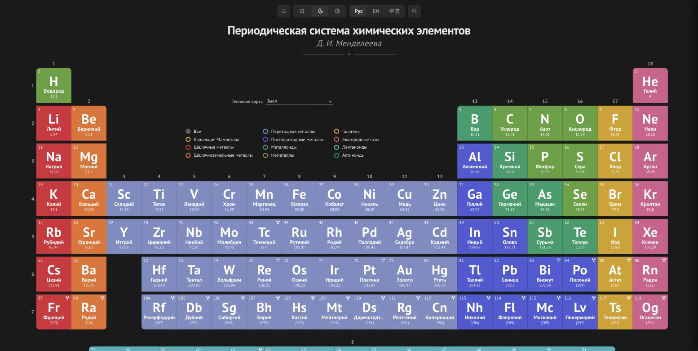
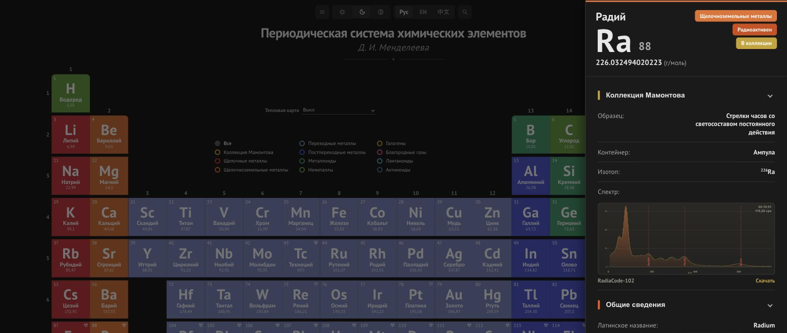
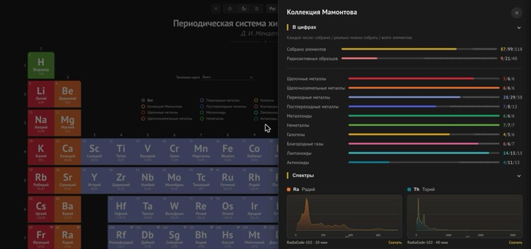

[English](README.md) | **Русский** | [中文](README.zh.md)

# Периодическая таблица химических элементов

Интерактивная периодическая таблица на Vue 3 + TypeScript: карточка каждого элемента с десятками справочных свойств, а также - главная особенность - личная физическая **коллекция элементов Мамонтова** с фото образцов, чистотой, изотопным составом и гамма-спектрами, снятыми дозиметром RadiaCode.

## Демо

Сайт: **[periodic.mamontov.tech](https://periodic.mamontov.tech)**

<table>
<tr>
<td><a href="docs/screenshots/demo-ru.jpg"></a></td>
<td><a href="docs/screenshots/demo-ru-element.jpg"></a></td>
<td><a href="docs/screenshots/demo-ru-collection.jpg"></a></td>
</tr>
</table>

## Возможности

- **Полная периодическая таблица** - все 118 элементов, включая f-блок (лантаноиды/актиноиды), с адаптивной раскладкой для десктопа и мобильных
- **Карточка элемента** - 12+ разделов: общие сведения, физические и термодинамические свойства, атомные и электромагнитные характеристики, кристаллическая решётка, реакционная способность, распространённость в природе, применение
- **Коллекция элементов** - состояние образца и контейнер, чистота, вес, изотоп, происхождение (прямой источник / продукт распада с цепочкой из нескольких изотопов), дата появления в коллекции и полная история замен (предыдущие образцы, причина замены каждого, сохранился ли он), фото, интерактивный гамма-спектр - увеличение по клику, метки изотопных линий, подтверждённые по самому измерению (а не просто взятые из справочника), скачивание исходного XML
- **Обзор коллекции** - отдельная панель со статистикой по категориям, всеми записанными спектрами, элементами, которые можно приобрести, и единым таймлайном всех приобретений/замен по всей коллекции, отсортированным по дате
- **Радиоактивность** - радиоактивные элементы отмечены на таблице, карточки NFPA 704 и пиктограмм GHS, данные по изотопам и периоду полураспада
- **География производства** - интерактивная карта на карточке каждого из 118 элементов, включая синтетические (страна лаборатории/ускорителя, где элемент получен) и промышленные газы (страны-лидеры по производству); там, где есть реальная разбивка по странам, прозрачность каждой страны отражает её долю в мировом производстве, с подсказкой-процентом при наведении
- **Поделиться** - отправить или скопировать прямую ссылку на карточку любого элемента прямо из её шапки (Web Share API с резервным копированием в буфер обмена)
- **Мультиязычность** - русский, английский, китайский (мгновенное переключение, автоопределение языка браузера)
- **Тёмная/светлая тема** - вручную или по системным настройкам
- **PWA** - устанавливается на устройство, работает офлайн (Workbox precache)

## Свойства карточки элемента

| Раздел | Свойства |
|---|---|
| Общие сведения | латинское название, английское название, год открытия, первооткрыватель, страна открытия, номер CAS, цвет, электронная оболочка |
| Описание | свободный текст |
| Применение | свободный текст о практическом применении |
| Свойства | атомный номер, атомная масса, плотность, температура плавления, температура кипения, валентность, период, группа, блок, положение в периодической таблице (мини-карта), эмиссионный спектр (изображение) |
| Атомные свойства | электронная конфигурация, заряд иона, потенциал ионизации, радиус атома, ковалентный радиус, радиус Ван-дер-Ваальса, степени окисления |
| Реакционная способность | электроотрицательность, валентность, энергия сродства к электрону |
| Термодинамические свойства | состояние вещества, молярная теплота плавления, удельная теплоёмкость, тепловое расширение, молярная теплота испарения |
| Электромагнитные свойства | удельная электропроводность, электрический тип, магнитный тип, объёмная/удельная/молярная магнитная восприимчивость, удельное сопротивление, температура сверхпроводимости |
| Кристаллическая решётка | структура решётки, параметры решётки, отношение, температура Дебая, пространственная группа, номер пространственной группы, изображение решётки |
| Дополнительные сведения | номер CID, номер RTEC, твёрдость по Бринеллю/Моосу/Виккерсу, объёмный модуль упругости, модуль Юнга, плотность жидкости, молярный объём, коэффициент Пуассона, модуль сдвига, скорость звука, показатель преломления, теплопроводность |
| Ядерные свойства | радиоактивность, основные изотопы, тип распада, период полураспада, период существования, эффективное сечение, ссылка на изотоп RadiaCode (для радиоактивных элементов) |
| Класс опасности NFPA 704 | огнеопасность, опасность для здоровья, реакционная способность, специальные обозначения |
| Пиктограммы опасности GHS | — |
| Распространённость | доля по массе во Вселенной, на Солнце, в океане, в организме человека, в земной коре, в метеоритах |
| География производства | отдельный раздел на каждом из 118 элементов - карта стран-производителей и краткое пояснение |

## Технологии

- [Vue 3](https://vuejs.org/) (Composition API, `<script setup>`) + [Vue Router 4](https://router.vuejs.org/)
- [TypeScript](https://www.typescriptlang.org/), [Vite 8](https://vitejs.dev/)
- [vite-plugin-pwa](https://vite-pwa-org.netlify.app/) (Workbox) - офлайн-режим и автообновление
- Собственные лёгкие composable для i18n и темизации (без внешних библиотек вроде vue-i18n/Pinia)
- ESLint + typescript-eslint

## Быстрый старт

Требуется Node.js 22+ и [pnpm](https://pnpm.io/).

```bash
pnpm install
pnpm dev
```

Приложение будет доступно на `http://localhost:5173`.

## Как завести свою коллекцию

Форкнули репозиторий и хотите вести собственную коллекцию элементов? Всё, что нужно поменять, лежит в **одном файле**: [`src/data/collection.ts`](src/data/collection.ts). Трогать `elements/elements.ts` или файлы локализации не нужно.

- `collectionName` / `siteTitle` / `siteUrl` - переименовать коллекцию и указать свой домен.
- `myElements` - карта `символ → детали`. Чтобы отметить элемент своим, достаточно добавить ключ; одного `{}` уже хватает («он у меня есть, подробностей пока нет»). Поля каждой записи сгруппированы по теме, все необязательны:
  - `physical` - `sampleState`, `container`, `purity`, `weight`, `allotrope`, `description`, `acquiredDate`.
  - `radioactive` - `isotope`, `sourceType`, `decayParent`. Для нерадиоактивных элементов всю группу можно опустить.
  - `spectrum` - `id`, `filename`, `annotations`, `backgroundSpectrumId`. Если файла измерения нет, всю группу можно опустить.
  - `history` - более ранние версии этого образца, от старых к новым, только если он когда-либо физически заменялся. У каждой записи те же поля, что и выше, плюс `retained` (сохранился ли старый образец) и `reason` (причина замены, значение из словаря `reasonLabels`). Отображается как таймлайн в модальном окне - его можно открыть иконкой часов рядом с заголовком раздела коллекции, а также из раздела «История изменений» на общей панели коллекции.
- Если встроенного словаря `sampleState`/`container`/`reason` (в [`src/locales/collection.ts`](src/locales/collection.ts)) не хватает - либо добавьте туда новую запись, либо вообще пропустите словарь и впишите готовый текст прямо в поле `physical.description` элемента - пример такого подхода есть у радиоактивных элементов в `collection.ts`. `radioactive.sourceType` - фиксированное значение `'primary'` / `'secondary'`.
- `physical.weight` - вес в граммах, обычный текст: `1.85` отобразится как «1.85 г», `~1.85` (с тильдой впереди) - как «~1.85 г» для оценочного, а не измеренного веса.
- `physical.allotrope` - название конкретной аллотропной модификации, если у элемента их несколько (например «Красный фосфор» для P, «Графит» для C) - отображается отдельной строкой рядом с `sampleState`, а не вместо неё.
- `physical.acquiredDate` - дата в формате ISO `YYYY-MM-DD`, отображается на карточке как «В коллекции с». В записи `history` означает «с какого момента была актуальна именно эта, более ранняя, версия».
- Любое текстовое поле можно задать как обычную строку (покажется на всех трёх языках интерфейса) или как `{ ru, en, zh }`, если нужен перевод.

Гамма-спектры (поля `spectrum.id`/`spectrum.filename`) - опциональны, указывайте их только если у вас правда есть файлы измерений для `src/data/spectra/`. Поле `spectrum.annotations` отмечает на графике справочные гамма/рентгеновские линии (энергия в кэВ + подпись) - добавляйте линию только убедившись, что это и задокументированная линия излучения, и она реально видна на фоне именно в вашем измерении, а не просто взята из таблицы. Поле `spectrum.backgroundSpectrumId` накладывает на график измерение естественного фона (сконвертированное так же, например снятое без образца в помещении) для сравнения - оно предполагает, что фон снят тем же прибором с той же калибровкой, что и образец, поскольку каналы сопоставляются по индексу и масштабируются по времени измерения, а не пересчитываются по энергии.

## Скрипты

| Команда | Назначение |
|---|---|
| `pnpm dev` | Дев-сервер с горячей перезагрузкой |
| `pnpm build` | Проверка типов (`vue-tsc`) + продакшен-сборка |
| `pnpm preview` | Локальный просмотр продакшен-сборки |
| `pnpm typecheck` | Только проверка типов |
| `pnpm lint` / `pnpm lint:fix` | Линтинг (ESLint) |
| `pnpm check` | `typecheck` + `lint` |

### CLI проекта

`cli/` - небольшой TypeScript-инструмент (запускается через [`tsx`](https://github.com/privatenumber/tsx), без отдельной сборки) с одной точкой входа и тремя подкомандами. Запустите `pnpm cli` без аргументов, чтобы получить интерактивное меню, либо сразу вызовите нужную подкоманду:

| Команда | Назначение |
|---|---|
| `pnpm cli` | Интерактивное меню - выбор инструмента (sitemap / spectrum / collection) |
| `pnpm cli sitemap` (также часть `pnpm build`) | Пересобрать `public/sitemap.xml` из `src/data/elements/elements.ts` |
| `pnpm data:spectrum:convert -- <input.xml> <output-id>` | Конвертация XML-спектра RadiaCode → JSON для коллекции |
| `pnpm data:collection:edit [-- <symbol>]` | Интерактивный мастер добавления/редактирования/удаления записей в `collection.ts` - запрашивает каждое поле, используя те же словари, что и само приложение, проверяет `sampleState`/`container`/`sourceType` по `src/locales/collection.ts` и сверяет `spectrum.id` с файлами, реально лежащими в `src/data/spectra/`. Передайте символ элемента, чтобы сразу перейти к нему, например `pnpm data:collection:edit -- Fr`. Переписывает только объект `myElements`, не трогая `collectionName`/`siteTitle`/`siteUrl` и комментарии. После сохранения запустите `pnpm check`. |

`cli/index.ts` также зарегистрирован как `bin` пакета (`periodic-table`), так что `pnpm exec periodic-table <команда>` тоже работает. `cli/**/*.ts` типизирован и проверяется в рамках `pnpm typecheck` (см. `tsconfig.node.json`), при этом типы импортируются напрямую из `src/types/` (`collection.ts` и соседних файлов) - поэтому мастер физически не может собрать запись `collection.ts`, не соответствующую реальной модели данных приложения.

## Структура проекта

```
src/
├── components/        # UI, сгруппированные по смыслу:
│   ├── layout/        #   шапка, футер, меню, поиск, переключатели языка/темы
│   ├── table/         #   сама периодическая таблица: ячейки, фильтры, тепловая карта
│   ├── element/       #   боковая панель с деталями элемента
│   ├── collection/    #   панель коллекции и графики гамма-спектров
│   └── common/        #   мелкие компоненты, общие для групп выше
├── composables/       # переиспользуемая логика (useElementDetail)
├── data/              # данные элементов, справочники, накладка личной коллекции
├── locales/           # переводы (ru/en/zh) и словари локализации
├── router/            # роуты (/, /element/:symbol)
├── theme/             # обработка темы (светлая/тёмная/авто) и настраиваемая палитра цветов (категории, тепловая карта, акцент коллекции, секции сайдбара)
├── types/             # общие типы TypeScript, сгруппированные по смыслу:
│   ├── element/       #   модель элемента, его детальные данные и форма UI-секций
│   └── collection/    #   личная коллекция и данные её спектров
├── utils/             # форматирование/хелперы, сгруппированные по смыслу:
│   ├── collection/    #   форматирование ярлыков/чистоты и статистика коллекции
│   ├── element/       #   сборка и форматирование данных отдельного элемента
│   └── external-links/ # ссылки на Wikipedia/YouTube/PubChem
└── views/             # экраны приложения
cli/                   # CLI проекта: генерация сайтмапа, конвертация спектров, мастер коллекции
```

## Docker

```bash
docker build -t periodic-table .
docker run -p 3000:3000 periodic-table
```

Многоступенчатая сборка: `node:22-alpine` собирает продакшен-бандл, финальный образ - `nginx:alpine`, отдающий статику (см. `Dockerfile`, `nginx.conf`). Пример Compose - в `docker-compose.yml`.

## Данные и источники

Справочные свойства элементов, пиктограммы GHS, фото образцов и рейтинги NFPA 704 агрегированы из открытых источников (PubChem, Wikipedia и другие); данные о странах добычи/производства - из USGS Mineral Commodity Summaries и других открытых источников; карта мира для этой функции - [`@svg-maps/world`](https://github.com/VictorCazanave/svg-maps) (CC-BY-4.0); гамма-спектры коллекции - собственные измерения автора. Данные предназначены для образовательного использования и личных проектов.

## Лицензия

Код в этом репозитории распространяется под [лицензией MIT](LICENSE). Сторонние справочные данные и изображения (см. [Данные и источники](#данные-и-источники)) могут регулироваться условиями своих исходных источников.
