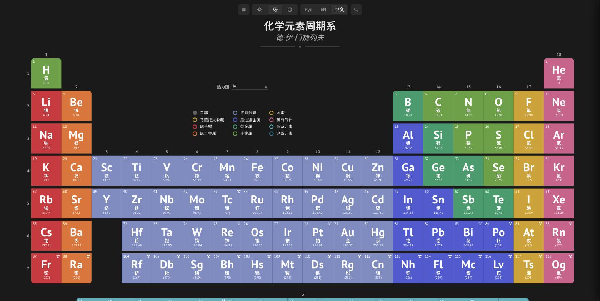
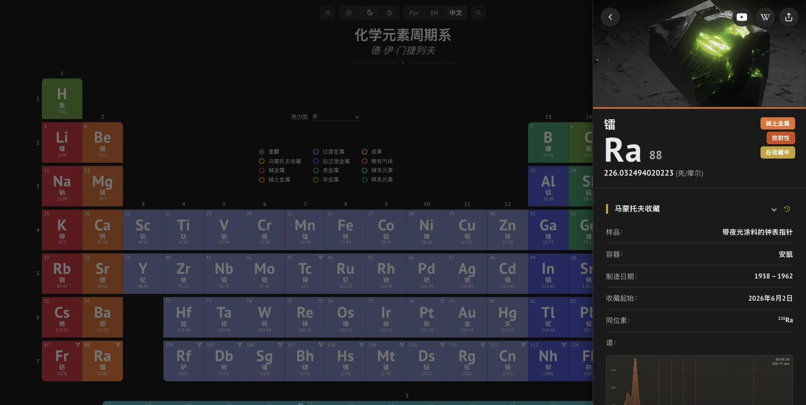
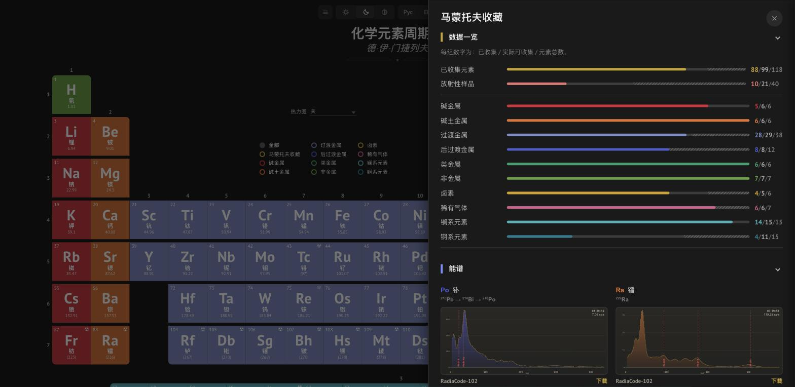

[English](README.md) | [Русский](README.ru.md) | **中文**

# 化学元素周期表

基于 Vue 3 + TypeScript 打造的交互式元素周期表：每个元素卡片包含数十项参考属性，以及本项目的核心特色 - 一份真实的个人 **马蒙托夫元素收藏**，包含样品照片、纯度、同位素组成，以及用 RadiaCode 剂量仪测得的伽马能谱。

## 演示

在线体验：**[periodic.mamontov.tech](https://periodic.mamontov.tech)**

<table>
<tr>
<td><a href="docs/screenshots/demo-zh.jpg"></a></td>
<td><a href="docs/screenshots/demo-zh-element.jpg"></a></td>
<td><a href="docs/screenshots/demo-zh-collection.jpg"></a></td>
</tr>
</table>

## 功能特性

- **完整元素周期表** - 全部 118 个元素，包括 f 区（镧系/锕系），适配桌面与移动端的响应式布局
- **元素卡片** - 12+ 个专项板块：概况、物理与热力学性质、原子与电磁特性、晶体结构、反应活性、自然丰度、应用
- **元素收藏** - 样品状态与容器、纯度、同位素、来源（直接来源 / 多步衰变链的衰变产物）、照片，以及交互式伽马能谱——点击放大、经实测确认的同位素参考线（而非直接照搬表格数值）、可下载原始 XML
- **收藏总览** - 独立面板，按类别统计收藏进度，并集中展示所有已记录的能谱
- **放射性标注** - 表格中标出放射性元素，提供 NFPA 704 与 GHS 象形图卡片、同位素与半衰期数据
- **多语言** - 俄语、英语、中文（即时切换，自动检测浏览器语言）
- **深色/浅色主题** - 手动切换或跟随系统
- **PWA** - 可安装到设备，支持离线使用（Workbox 预缓存）

<details>
<summary><strong>元素卡片完整属性列表</strong>（点击展开）</summary>

**概况** - 拉丁名、英文名、发现年份、发现者、发现国家、CAS编号、颜色、电子壳层

**简介** - 自由文本简介

**应用** - 自由文本的实际用途概述

**性质** - 原子序数、原子量、密度、熔点、沸点、化合价、周期、族、区、在周期表中的位置（缩略图）、发射光谱（图片）

**原子性质** - 电子构型、离子电荷、电离能、原子半径、共价半径、范德华半径、氧化态

**反应活性** - 电负性、化合价、电子亲和能

**热力学性质** - 物态、熔化热、比热容、热膨胀、汽化热

**电磁性质** - 电导率、电学类型、磁性类型、体积/质量/摩尔磁化率、电阻率、超导温度

**晶体结构** - 晶格结构、晶格参数、比率、德拜温度、空间群、空间群编号、晶格结构图

**附加信息** - CID编号、RTEC编号、布氏/莫氏/维氏硬度、体积模量、杨氏模量、液态密度、摩尔体积、泊松比、剪切模量、声速、折射率、热导率

**核性质** - 放射性、主要同位素、衰变类型、半衰期、存在周期、中子截面、RadiaCode同位素参考链接（放射性元素）

**NFPA 704 危险性** - 易燃性、健康危害、反应性、特殊说明

**GHS 危险性图示**

**丰度** - 在宇宙、太阳、海洋、人体、地壳和陨石中按质量计的占比

</details>

## 技术栈

- [Vue 3](https://vuejs.org/)（Composition API，`<script setup>`）+ [Vue Router 4](https://router.vuejs.org/)
- [TypeScript](https://www.typescriptlang.org/)，[Vite 8](https://vitejs.dev/)
- [vite-plugin-pwa](https://vite-pwa-org.netlify.app/)（Workbox）- 离线模式与自动更新
- 自研的轻量 composable 实现 i18n 与主题切换（不依赖 vue-i18n/Pinia 等外部库）
- ESLint + typescript-eslint

## 快速开始

需要 Node.js 22+ 和 [pnpm](https://pnpm.io/)。

```bash
pnpm install
pnpm dev
```

应用将运行在 `http://localhost:5173`。

## 建立属于你自己的收藏

Fork 了本项目、想记录自己的元素收藏？需要修改的内容全部集中在**一个文件**里：[`src/data/collection.ts`](src/data/collection.ts)。不需要动 `elements/elements.json`，也不需要动语言文件。

- `collectionName` / `siteTitle` / `siteUrl` - 重命名收藏名称，并换成你自己的域名。
- `myElements` - 一个"元素符号 → 详情"的映射表。只要加上一个键就代表这个元素归你所有；空对象 `{}` 已经足够（"我有这个元素，细节以后再补"）。每条记录的字段按主题分组，均为可选：
  - `physical` - `sampleState`、`container`、`purity`、`description`。
  - `radioactive` - `isotope`、`sourceType`、`decayParent`。非放射性元素可以整组省略。
  - `spectrum` - `id`、`filename`、`annotations`。没有测量文件时可以整组省略。
- 如果内置的 `sampleState`/`container` 词汇表（在 [`src/locales/collection.ts`](src/locales/collection.ts) 中）不够用，你可以在那里添加新条目，也可以完全跳过词汇表，直接把现成的文字写进该元素的 `physical.description` 字段 - `collection.ts` 里的放射性元素就是这么做的，可以参考。`radioactive.sourceType` 固定取值为 `'primary'` 或 `'secondary'`。
- 任何文本字段既可以写成一个普通字符串（在三种界面语言下都显示同一内容），也可以写成 `{ ru, en, zh }` 对象来分别翻译。

伽马能谱（`spectrum.id`/`spectrum.filename` 字段）是可选的 - 只有当你确实有测量文件要放进 `src/data/spectra/` 时才需要填写。`spectrum.annotations` 字段在图表上标出参考伽马/X 射线谱线（能量单位 keV + 标签）- 只有当它既是该同位素的已记录发射线，又确实能在你自己的测量本底之上看到时，才值得添加，而不是直接照抄表格数值。

## 脚本命令

| 命令 | 用途 |
|---|---|
| `pnpm dev` | 支持热重载的开发服务器 |
| `pnpm build` | 类型检查（`vue-tsc`）+ 生产环境构建 |
| `pnpm preview` | 本地预览生产构建 |
| `pnpm typecheck` | 仅执行类型检查 |
| `pnpm lint` / `pnpm lint:fix` | 代码检查（ESLint） |
| `pnpm check` | `typecheck` + `lint` |

### 项目 CLI

`cli/` 是一个小型 TypeScript 工具（通过 [`tsx`](https://github.com/privatenumber/tsx) 运行，无需单独构建），有一个入口和三个子命令。不带参数运行 `pnpm cli` 会显示交互式菜单，也可以直接调用某个子命令：

| 命令 | 用途 |
|---|---|
| `pnpm cli` | 交互式菜单 - 选择要用的工具（sitemap / spectrum / collection） |
| `pnpm cli sitemap`（也是 `pnpm build` 的一部分） | 从 `src/data/elements/elements.json` 重新生成 `public/sitemap.xml` |
| `pnpm data:spectrum:convert -- <input.xml> <output-id>` | 将 RadiaCode 的 XML 能谱转换为收藏用的 JSON |
| `pnpm data:collection:edit [-- <symbol>]` | 交互式向导，用于添加/编辑/删除 `collection.ts` 中的条目 - 使用与应用本身相同的词汇表逐字段询问，依据 `src/locales/collection.ts` 校验 `sampleState`/`container`/`sourceType`，并核对 `spectrum.id` 是否在 `src/data/spectra/` 中真实存在对应文件。传入元素符号即可直接跳转到该元素，例如 `pnpm data:collection:edit -- Fr`。只会重写 `myElements` 对象，`collectionName`/`siteTitle`/`siteUrl` 及注释保持不变。保存后请运行 `pnpm check`。 |

`cli/index.ts` 同时被注册为该包的 `bin`（`periodic-table`），所以 `pnpm exec periodic-table <命令>` 也可以用。`cli/**/*.ts` 已纳入 `pnpm typecheck` 的类型检查范围（见 `tsconfig.node.json`），其类型直接从 `src/types/`（`collection.ts` 等文件）导入，因此该向导不可能构造出与应用真实数据模型不一致的 `collection.ts` 条目。

## 项目结构

```
src/
├── components/      # UI 组件，按主题分组：
│   ├── layout/      #   页头、页脚、菜单、搜索、语言/主题切换器
│   ├── table/       #   周期表本身：单元格、筛选器、热力图选择器
│   ├── element/     #   元素详情侧边栏
│   ├── collection/  #   收藏面板与伽马能谱图表
│   └── common/      #   以上各组共用的小组件
├── composables/     # 可复用逻辑（useElementDetail）
├── data/            # 元素数据、参考表、收藏能谱
├── locales/         # 翻译文本（ru/en/zh）与本地化词典
├── router/          # 路由（/、/element/:symbol）
├── theme/           # 主题处理（浅色/深色/自动）
├── types/           # element.ts、collection.ts、elementDetail.ts、detailSection.ts、
│                    # heatmap.ts、collectionSpectrum.ts、ghs.ts、category.ts
├── utils/           # 按主题分组：
│   ├── collection/  #   收藏标签/统计格式化
│   ├── element/     #   元素详情分区、格式化、同位素、搜索、图片缓存
│   ├── external-links/ # Wikipedia/YouTube/PubChem 链接生成
│   ├── heatmap.ts   #   热力图定义与数据集
│   ├── localizedLabel.ts
│   └── pwaStandalone.ts
└── views/           # 应用页面
cli/                 # 项目 CLI：生成站点地图、转换能谱、收藏向导
```

## Docker

```bash
docker build -t periodic-table .
docker run -p 3000:3000 periodic-table
```

多阶段构建：`node:22-alpine` 构建生产环境产物，最终镜像为提供静态文件服务的 `nginx:alpine`（详见 `Dockerfile`、`nginx.conf`）。Compose 示例见 `docker-compose.yml`。

## 数据与来源

元素参考属性、GHS 象形图、样品照片与 NFPA 704 评级，是从公开来源（PubChem、维基百科等）聚合而来的；收藏的伽马能谱则为作者本人的实测数据。这些数据仅用于教育与个人项目用途。

## 许可证

本仓库中的代码采用 [MIT 许可证](LICENSE)。第三方参考数据与图片（见"数据与来源"一节）可能受其原始来源自身条款的约束。
